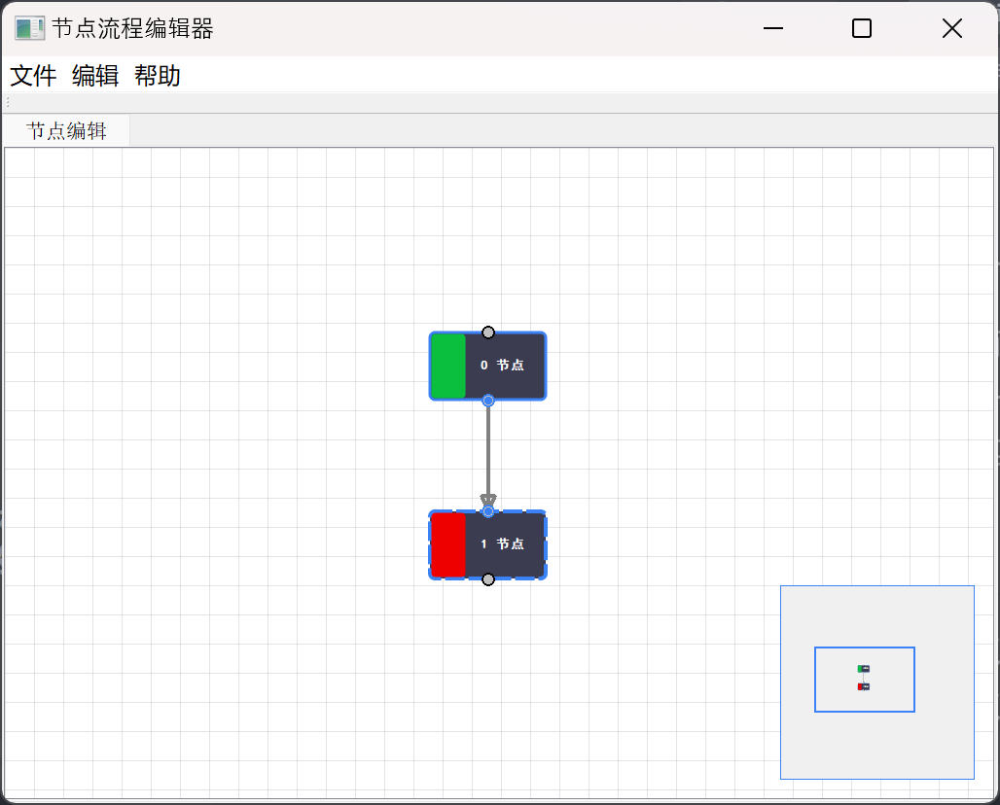

# Qt Node Editor

Qt Node Editor 是一个基于 Qt 的节点流程编辑器，支持创建、连接和管理节点，适用于构建可视化编程工具、工作流编辑器或数据流图。

## 功能特性
- **节点系统**: 支持创建、拖动和删除节点。
- **输入/输出接口**: 每个节点支持输入和输出接口。
- **节点连接**: 可视化连接节点接口，支持拓扑排序。
- **任务执行**: 节点支持异步任务执行，并提供状态反馈。
- **多标签页支持**: 支持多个流程的编辑和管理。
- **交互式 UI**: 支持鼠标拖动、右键菜单等交互操作。

## 快速开始

### 环境要求

- **Qt 5.9+** (推荐 Qt 5.14)
- **C++14** 兼容的编译器 (如 MSVC 2022)

### 构建步骤

1. 克隆仓库：
    ```bash
    git clone https://github.com/bingle.bai/QtNodeEditor.git
    cd QtNodeEditor
    ```
2. 使用 Visual Studio 2022 打开项目。
3. 配置 Qt Kit 和编译环境。
4. 构建并运行项目。

### 运行项目

- 启动程序后，主窗口将显示一个场景，您可以在其中添加、移动和连接节点。

## 使用说明

- **添加节点**: 右键点击空白区域，选择“创建默认节点”或“创建自定义节点”。
- **连接节点**: 从一个节点的输出接口拖动到另一个节点的输入接口。
- **执行任务**: 使用菜单中的“执行流程”功能。
- **保存/加载流程**: 使用菜单中的“保存流程”和“加载流程”功能。

## 项目结构

- `Node.h/cpp`: 核心节点类，管理节点的接口、连接和任务执行。
- `NodeSocket.h/cpp`: 表示节点的输入/输出接口。
- `NodeConnection.h/cpp`: 管理节点接口之间的连接。
- `NodeSceneMap.h/cpp`: 管理场景和所有节点/连接。
- `NodeSceneMap.h/cpp`: 缩略图。
- `NodeView.cpp`: 处理视图和用户交互。
- `QtNodes.h/cpp`: 主窗口类，管理 UI 和流程逻辑。

## 示例

以下是一个简单的使用示例：

1. 创建两个节点。
2. 将第一个节点的输出接口连接到第二个节点的输入接口。
3. 使用菜单中的“执行流程”功能。



## 自定义

- **自定义节点逻辑**: 继承 `Node` 或 `Task` 类并重写相关方法。
- **自定义外观**: 修改 `Node::paint` 方法以更改节点的绘制逻辑。

## 贡献

欢迎贡献代码或提出建议！请通过以下步骤参与：

1. Fork 本仓库。
2. 创建一个分支 (`git checkout -b feature/your-feature`)。
3. 提交更改 (`git commit -m 'Add some feature'`)。
4. 推送到分支 (`git push origin feature/your-feature`)。
5. 提交 Pull Request。

## 许可证

本项目基于 [MIT License](LICENSE) 开源。

## 关于

Qt Node Editor 是一个开源项目，旨在为开发者提供一个简单易用的节点编辑器框架。如果您有任何问题或建议，请随时提交 Issue 或联系开发者。

---